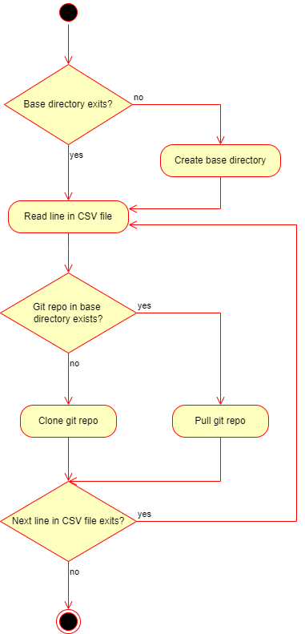
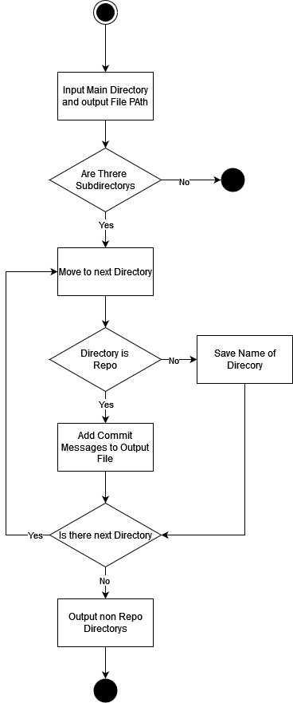

# Projekt Dokumentation

# Skript 1: [git_clone_update_repos.bash](../bin/Script_1/git_clone_update_repos.bash)



## Vorbereitungen

Damit das Programm funktionieren kann muss folgender Befehl ausgeführt werden:

```
sodo apt install git
```

Dabei wird git heruntergeladen. Es wird benötigt um die Logs auszulesen.

## Parameter

### Parameter 1 (input file):

Es muss ein input file angegeben werden, in welchem sich die GIT-Urls, sowie die Namen der Verzeichnisse befinden. Falls das input file nicht gefunden wird oder leer ist, wird ein ensprechender Fehler ausgegeben.

### Parameter 2 (Pfad/Name zum Zielverzeichnis):

Es muss der Pfad zum input file oder mindestens der Name angegeben werden. Falls kein Pfad angegeben wird, wird im aktuellen Verzeichnis nach dem input file gesucht.

### Fehlerhafte Parameter

Bei falschen oder fehlenden Parametern wird eine Fehlermeldung und die Benutzung der Parameter ausgegeben.

## Ablauf

# Skript 2: [git_extract_commits.bash](../bin/Script_2/git_extract_commits.bash)



## Vorbereitungen

Damit das Programm funktionieren kann muss folgender Befehl ausgeführt werden:

```
sodo apt install git
```

Dabei wird git heruntergeladen. Es wird benötigt um die Logs auszulesen.

## Parameter

### Parameter 1 (Path):

Es muss angegeben welches Directory nach Repositiories durchsucht werden soll. Dabei kann einfach der Pfad zu dem Directroy angegeben werden.

### Parameter 2 (Path):

Es muss angegeben werden in welches Directory die Output CSV Dateien gespeichert werden sollen.

### Fehlerhafte Parameter

Bei falschen oder fehlenden Parametern wird eine spezifische Fehlermeldung angezeigt. So kann man den fehler schnell erkennen und beheben. Das Script führt keine befehle aus, bevor nicht alle Parameter korrekt sind.

## Ablauf

Das angegebene Directory wird auf Git-Repositories durchsucht. Diese werden im Terminal angzeigt.

Ebenfalls werden die Nicht-Repo-Directories angezeigt.

Von den Repositories werden dan jeweils die Logs ausgelesen und formatiert in einem CSV File gespeichert.

## Terminal Output

Im Terminal werden sämtliche Fehlermeldungen angezeigt. Anhand der Fehlermeldungen kann erkennt werden was falsch gelaufen ist.

Ebenfalls werden die Repositories und die nicht-Repositories angezeigt. Jeweils in einer anderen Farbe.

## File Output (CSV)

Die Logs der Repositories werden im angegebenen Directory in einer CSV Datei gespeichert. Der Separator ist ein ','.
Zu dem Namen des Files wird jeweils eine unique ID hinzugefügt, um doppelte Files zu vermeiden.
